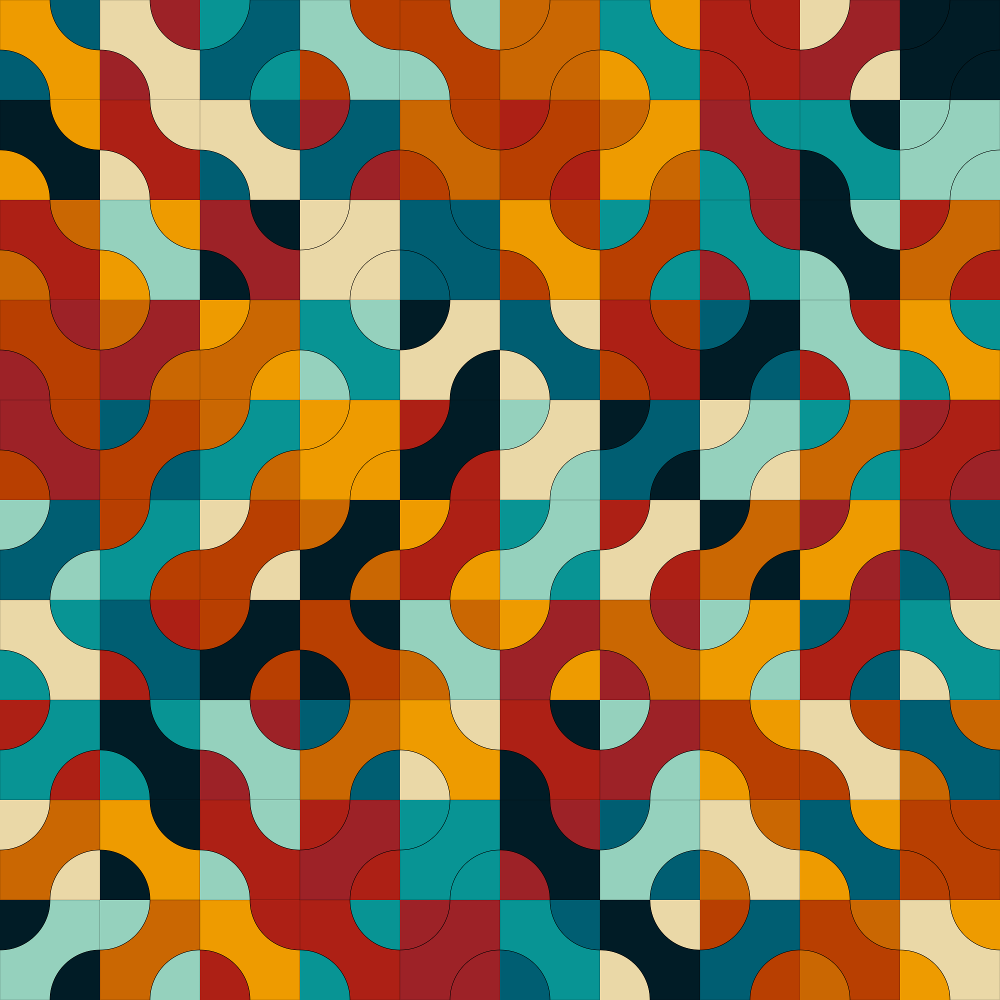

# Graeco-Latin square

Visualisation of a 10 x 10 graeco-latin square, also called an Euler square, inspired by [this tweet](https://twitter.com/divbyzero/status/1627758659030732816) from Dave Richeson.

If you want to generate the image with a different color scheme, you can edit the [p5.js](https://p5js.org/) script [here](https://editor.p5js.org/ABohynDOE/full/cbcajyD-Q).
